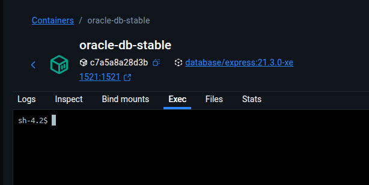

# Oracle Database XE 21c con ORDS (Web Manager) en Docker Compose


Este repositorio proporciona una configuración completa de **Docker Compose** para levantar una instancia de **Oracle Database 21c Express Edition (XE)** junto con **Oracle REST Data Services (ORDS)**, lo que permite acceder a una interfaz web (SQL Developer Web) para gestionar tu base de datos de forma inmediata.

------


## 🚀 Inicio Rápido

### ⚠️ Requisitos


Asegúrate de tener instalado:

1. **Docker Engine**
2. **Docker Compose** (o el comando `docker compose` integrado en versiones recientes de Docker).


### 1. Clonar el Repositorio


Bash

```
git clone [URL_DE_TU_REPOSITORIO]
cd [URL_DE_TU_REPOSITORIO]
```


### 2. Iniciar docker compose


Ejecuta el siguiente comando para construir y levantar ambos contenedores:

Bash

```
docker compose up -d
```


### 3. Verificar el Estado


La inicialización de Oracle Database XE puede tomar varios minutos. Puedes verificar el estado con:

Bash

```
docker compose ps
docker logs oracle-db-stable -f
```

Espera a que el contenedor `oracle-db-stable` esté completamente `healthy` (sano) y que el contenedor `oracle-ords-official` haya completado su instalación.

------


## ⚙️ Servicios y Puertos


| **Servicio**           | **Imagen**          | **Puerto Host** | **Puerto Contenedor** | **Descripción**                      |
| ---------------------- | ------------------- | --------------- | --------------------- | ------------------------------------ |
| `oracle-db-stable`     | `express:21.3.0-xe` | **1521**        | 1521                  | Base de datos Oracle XE.             |
| `oracle-ords-official` | `ords:25.3.1`       | **8080**        | 8080                  | Gestor Web (ORDS/SQL Developer Web). |


### Acceso a la Interfaz Web (SQL Developer Web)


Una vez que ambos contenedores estén levantados y ORDS haya terminado la instalación, accede a tu navegador:

🔗 **URL:** `http://localhost:8080/ords/sql-developer`

------


## 🔑 Variables de Configuración


Las contraseñas y configuraciones importantes se definen en el archivo `docker-compose.yml`.

| **Servicio**           | **Variable**         | **Valor por Defecto**          | **Descripción**                                         |
| ---------------------- | -------------------- | ------------------------------ | ------------------------------------------------------- |
| `oracle-db-stable`     | `ORACLE_PWD`         | `MiPasswordSeguro123`          | Contraseña para usuarios **SYS** y **SYSTEM**.          |
| `oracle-ords-official` | `CONN_STRING`        | `oracle-db-stable:1521/XEPDB1` | Cadena de conexión interna al PDB (Pluggable Database). |
| `oracle-ords-official` | `ORDS_PWD`           | `MiPasswordSeguro123`          | Contraseña para que ORDS se conecte a la DB como SYS.   |
| `oracle-ords-official` | `ORDS_USER_PASSWORD` | `OrdsAdminPassword123`         | Contraseña para el usuario **ORDS_PUBLIC_USER**.        |

**🚨 Recomendación:** Modifica el valor de `ORACLE_PWD` y `ORDS_USER_PASSWORD` en el archivo `docker-compose.yml` antes de desplegar en producción.

------


***SIN ESTO NO FUNCIONARA SQL DEVELOPER (INTERFAZ WEB)***

## 👥 Creación de un Nuevo Usuario y Habilitación para ORDS


Para que un nuevo usuario de base de datos pueda acceder a **SQL Developer Web**, debe ser creado y luego tener habilitada la **funcionalidad de servicios REST** (Oracle REST Data Services).


### 1. Conexión a la Base de Datos



Conéctate al contenedor de base de datos usando `sqlplus` como usuario `SYS` (o `SYSTEM`):

Bash

```
docker exec -it oracle-db-stable sqlplus sys/MiPasswordSeguro123@XEPDB1 as sysdba
```


### 2. Crear un Nuevo Usuario


Ejecuta los siguientes comandos SQL para crear un usuario y otorgarle los permisos básicos. Reemplaza `NEW_USER` y `NEW_PASSWORD` con tus valores deseados.

SQL

```
-- 2.1. Crear el usuario
CREATE USER NEW_USER IDENTIFIED BY NEW_PASSWORD DEFAULT TABLESPACE USERS QUOTA UNLIMITED ON USERS;

-- 2.2. Otorgar permisos básicos de sesión y recursos
GRANT CONNECT, RESOURCE, CREATE VIEW TO NEW_USER;

-- 2.3. Salir de sqlplus
EXIT;
```


### 3. Habilitar el Esquema para ORDS (Acceso a SQL Developer Web)


Este es el paso clave para que el nuevo usuario pueda autenticarse a través de la interfaz web de ORDS.

1. Vuelve a conectarte al contenedor `oracle-db-stable`, esta vez como `SYSTEM` o `SYS`.

   Bash

   ```
   docker exec -it oracle-db-stable sqlplus sys/MiPasswordSeguro123@XEPDB1 as sysdba
   ```

2. Ejecuta el procedimiento `ORDS.ENABLE_SCHEMA`.

   SQL

   ```
   -- Habilita el esquema (NEW_USER) para el acceso a ORDS.
   BEGIN
     ORDS.ENABLE_SCHEMA(
       p_enabled             => TRUE,
       p_schema              => 'NEW_USER',
       p_url_mapping_type    => 'BASE_PATH',
       p_url_mapping_pattern => 'new_user_api', -- Define un prefijo de URL para los servicios REST (opcional)
       p_auto_rest_auth      => TRUE
     );
   END;
   /
   
   -- Otorga permisos para usar el repositorio de metadatos de ORDS (necesario para SQL Developer Web).
   GRANT ORDS_ADMINISTRATOR_ROLE TO NEW_USER;
   
   -- El permiso ORDS.METADATA es generalmente parte de los roles otorgados por ORDS.ENABLE_SCHEMA,
   -- pero puedes verificar que tenga los roles necesarios para SQL Developer Web:
   GRANT EXECUTE ON ORDS_PUBLIC_USER.ORDS.CREATE_REST_SERVICE_TEMPLATE TO NEW_USER;
   
   -- Confirma los cambios
   COMMIT;
   
   EXIT;
   ```

   si sale un error como este 

   > BEGIN ORDS.ENABLE_SCHEMA(p_schema => 'EXPO_USER', p_url_mapping_type => 'BASE_PATH', p_url_mapping_pattern => 'expo', p_auto_rest_auth => TRUE); END; * ERROR at line 1: ORA-06598: insufficient INHERIT PRIVILEGES privilege ORA-06512: at "ORDS_METADATA.ORDS", line 1 ORA-06512: at line 1

   Ejecuta esta linea para brindar privilegios a ords.metadata

3. ```
   grant inherit privileges on user SYSTEM to ORDS_METADATA;
   ```

### 4. Prueba de Acceso


Ahora el usuario `NEW_USER` debería poder iniciar sesión en **SQL Developer Web** a través de:

🔗 **URL:** `http://localhost:8080/ords/sql-developer`

- **Usuario:** `NEW_USER`
- **Contraseña:** `NEW_PASSWORD`

------


## 🧹 Limpieza


Para detener y eliminar los contenedores, la red y el volumen de datos persistentes:

Bash

```
docker compose down -v
```
